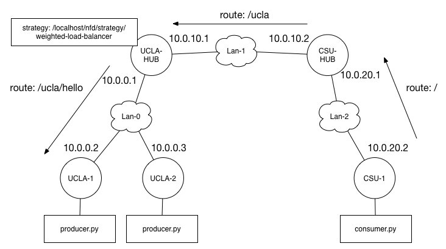

GEC 21 NDN Tutorial Code Walkthrough
==============================================

This guide will walk you through writing a simple NDN application with
PyNDN2 as well as how to develop a new forwarding strategy for NFD.
More information about NFD, ndn-cxx, PyNDN2, and the rest of the NDN
Platform, can be found at the [NDN Platform homepage](http://named-data.net/codebase/platform/).

The following NDN software has been pre-installed on the provided GENI
node images:

* NFD 0.2.0
* ndn-cxx 0.2.0
* PyNDN2

**Part 1** of code walkthrough will cover writing NDN applications
with the Python CCL library (PyNDN2). We provide template files
(method stubs) that you can fill in using this document under
`app-templates/`. The Python library has been pre-installed on the
GENI node image via pip and should be usable from anywhere (including
the interactive interface):

    $ python
    >>> import pyndn
    >>> print "Hello", pyndn.Name("world").toUri()
    Hello,  /world

**Part 2** will discuss how forwarding strategies and how to implement
your own. Once again, we provide code templates under
`strategy-templates/`. We also provide two applications (consumer.py
and producer.py) to help test and demonstrate the completed strategies
that can be found under `tools/`. In particular, producer.py allows
you to delay the producer's response to artifically add latency.

Solution code for both Part 1 and Part 2 is available under the `solutions/` directory.

# Setup

## Creating a GENI Slice

* import **ndn-tutorial-rspec.txt** into Jacks
* select your assigned aggregate manager from the drop down menu

## Environment Configuration

If you are on OS X or Linux, you should now configure the environment
variables in `tools/ndn-tutorial-config.sh`. These variables are used
by the other `tools/` scripts to setup the tutorial scenarios and move
files to the GENI nodes. You must provide your GENI username, the path
to your SSH key, and define the GENI hosts you will be using in
`hostname:port` notation. For example:

    # GENI username
    USERNAME="stevendi"

    # GENI SSH key
    KEY="~/.ssh/id_geni_ssh_rsa"

    # domain names or IP addresses for GENI slice nodes in "host:port" form
    GENI_HOST="pc5.instageni.northwestern.edu"

    UCLA_HUB="${GENI_HOST}:31038"
    UCLA_1="${GENI_HOST}:31036"
    UCLA_2="${GENI_HOST}:31037"
    ...

## Initial Node Setup

The provided `ndn-tutorial-rspec.txt` specifies an Ubuntu 12.04 disk
image that is preloaded with NDN software. However, there is one last
set of scripts that must first be copied to the remote nodes and moved
into position. Please execute `tools/copy-scripts.sh` to complete the
node setup.

**NOTE:** If you cannot execute shell scripts, please copy the two
  scripts found under `tools/.remote-scripts/` to `/usr/local/bin` on
  each GENI node.

# Part 1: Writing NDN Applications with PyNDN2

This section illustrates how to write simple, but functionally
complete, "Hello World" NDN consumer and producer applications using
the PyNDN2 library. In particular, you will learn how to:

* listen for Interests matching a namespace
* create and send Interests and Data packets
* catch and handle common NDN communication error

These example applications may be a little longer and complex
than the minimal NDN "Hello World" application, but we hope they will
serve as useful starting points for your own applications.

You will implement the following scenario:

The above topology is similar in structure to the real NDN testbed;
university and private sites connect to one another over UDP
tunnels. Specifically, each site has a "hub" node running the new NDN
Forwarding Daemon (NFD). Users at each site also run NFD on their own
machines and connect to the testbed through their local hub.

For this tutorial, you will emulate consumer applications running on
user machines at UCLA (UCLA-1 and UCLA-2) and a producer application
at CSU (CSU-1). After setting up routing between UCLA and CSU, your
consumers can retrieve some simple generated content from the
producer. Finally, you will observe the caching and reuse of named
data.

#### Hello World Producer

Our producer application will serve a "Hello" Data packet in response
to each incoming Interest. To achieve this, the producer will register
a prefix to "listen" for Interests matching said prefix.

Let's get started by importing the relevant modules from PyNDN2.

    from pyndn import Name
    from pyndn import Data
    from pyndn import Face
    from pyndn.security import KeyChain

One common application pattern is to create a driving class to
encapsulate our application's logic. For our purposes, let's call this
class Producer:

    class Producer(object):

        def __init__(self):
            self.keyChain = KeyChain()
            self.isDone = False

We've initialized the `Producer` with a `KeyChain`
instance. `KeyChain` is an abstraction around your system's key
management. It associates identities with their respective keys. For
example, a user may have multiple identities such as "Home", "Work",
"Friends" and use a different keypair for each. `KeyChain` also has a
concept of a default identity that can be used without explicitly
specifying the name of an identity.

To see this in action, we'll add a `run` method to `Producer`.

    def run(self, namespace):
        # Create a connection to the local forwarder over a Unix socket
        face = Face()

        prefix = Name(namespace)

        # Use the system default key chain and certificate name to sign commands.
        face.setCommandSigningInfo(self.keyChain, \
                                   self.keyChain.getDefaultCertificateName())

        # Also use the default certificate name to sign Data packets.
        face.registerPrefix(prefix, self.onInterest, self.onRegisterFailed)

        print "Registering prefix", prefix.toUri()

        # Run the event loop forever. Use a short sleep to
        # prevent the Producer from using 100% of the CPU.
        while not self.isDone:
            face.processEvents()
            time.sleep(0.01)

`run` is responsible for establishing a connection to the local
forwarder (NFD), registering a prefix to publish content under, and
running the program's event loop. The commented lines denote the
essential parts of `run`'s operation, but let's focus on the prefix
registration process.

The first step for registering a prefix is to configure the library
for command signing. NFD requires an authorized signed Interests in
order to perform management actions like modifying the FIB. We
configure the library in the above code with with the call to
`setCommandSigningInfo`.

Next, we need to inform NFD of the prefix our producer serves data
for. Prefix registration tells NFD to send matching Interests to our
application's Face. This is accomplished by calling `registerPrefix`
with the prefix we want to register (represented by an `Name` object)
with two callback functions (`self.onInterest` and
`self.onRegisterFailed` here).

The first callback, `onInterest`, is triggered whenever an Interest
matching the registered prefix is delivered to the application's Face.
This callback takes several arguments: a prefix (`Name` instance), the
arriving `Interest`, a `Transport`, and the registered prefix's ID.

The second callback, `onRegisterFailed`, is used if registration
fails. **NOTE** If prefix registration fails, a good first step is to
ensure that both the **nfd** and **nrd** processes are running. The
`onRegisterFailed` callback is given the name of the prefix that
failed to register.

    def onInterest(self, prefix, interest, transport, registeredPrefixId):
        interestName = interest.getName()

        data = Data(interestName)
        data.setContent("Hello, " + interestName.toUri())

        hourMilliseconds = 3600 * 1000
        data.getMetaInfo().setFreshnessPeriod(3600 * 1000)

        self.keyChain.sign(data, self.keyChain.getDefaultCertificateName())

        transport.send(data.wireEncode().toBuffer())

        print "Replied to: %s" % interestName.toUri()

    def onRegisterFailed(self, prefix):
        print "Register failed for prefix", prefix.toUri()
        self.isDone = True

The `onInterest` callback is the more interesting callback (we have
limited options if prefix registration fails). The
`Producer.onInterest` method essentially echoes the incoming
Interest. First, it creates a new `Data` instance using the `Name` it
extracts from the `Interest`. Next, it sets the payload of the created
Data packet using `Data.setContent`. In this example, we're just
setting the payload to a simple hello message.

Once we've setup our response Data packet, we need to sign and publish
it. Our `KeyChain` instance provides a `sign` method that
cryptographically signs the packet with the specified identity. Here,
we just use the default identity as we did during prefix registration.

The signed packet can now be published using the provided `transport`
argument's `send` method. The `Transport` class is an abstraction of
lower level communication methods. PyNDN2 currently supports TCP, UDP,
and Unix socket transport. The `onInterest` callback will be given the
specific transport channel instance that the Interest arrived over so
that you can respond to the correct interface.

`Transport.send` requires an array-type buffer of data to send. We can
obtain this kind of arrangement from our `Data` instance by wire
encoding it, which returns a `SignedBlob` instance, and converting it
to a buffer. The exact nature of the buffer depends on whether you're running
Python 2 or 3. For more details, please see [pyndn.util.Blob](https://github.com/named-data/PyNDN2/blob/master/python/pyndn/util/blob.py)

Together, the previously described methods round out everything
necessary to create a simple producer. To run your producer, first
copy it to the CSU-1 node. Next, start NFD using the `nfd-start`
script (already on your path) and wait for your shell's prompt to
return. You can now run your producer script:

    python hello_producer.py -n /csu/hello

The producer will not do much because it is waiting for
Interests. However, you should see it print a "Registering prefix
/csu/hello" When you're done, you can stop the producer with ctrl-c
and NFD with the `nfd-stop` script.

#### Hello World Consumer

Next, we'll make a consumer application to send Interests to our
producer and print the response messages. As with the producer,
we'll first begin by creating an encapsulating `Consumer` class.

    from pyndn import Name
    from pyndn import Data
    from pyndn import Face
    from pyndn.security import KeyChain

    class Consumer(object):
        def __init__(self, prefix):
            self.prefix = Name(prefix)
            self.outstanding = dict()
            self.isDone = False
            self.face = Face("127.0.0.1")

The `Consumer` constructor initializes more state than
`Producer`.  As we will see in a moment, this is because we want to
build a reasonably robust client that can perform retransmission.
Also note that the consumer's Face is initialized with an IP address.
This results in `Consumer` using TCP to connect to the local NFD
instance (recall that `Producer` uses the `Face()` constructor to
create a Unix socket Face). We could have just as easily used a Unix
socket Face, but chose to use TCP to demonstrate the alternative
creation process.

    def run(self):
        try:
            self._sendNextInterest(self.prefix)

            while not self.isDone:
                self.face.processEvents()
                time.sleep(0.01)

        except RuntimeError as e:
            print "ERROR: %s" %  e

Like `Producer`, `Consumer` also has a `run` containing the event
loop. The main difference is the `self._sendNextInterest` call before
the event loop begins. `Consumer` abstracts the Interest creation and
sending process into its own method to simplify retransmission (i.e
avoid code duplication).

    def _sendNextInterest(self, name):
        interest = Interest(name)
        uri = name.toUri()

        interest.setInterestLifetimeMilliseconds(4000)
        interest.setMustBeFresh(True)

        if uri not in self.outstanding:
            self.outstanding[uri] = 1

        self.face.expressInterest(interest, self._onData, self._onTimeout)
        print "Sent Interest for %s" % uri

The `_sendNextInterest` method creates an Interest from a `Name` and
configures its lifetime and the freshness selector. The lifetime
attribute tells each NDN node to expire the Interest **N**
milliseconds after it arrives (here we use 4000 ms). The freshness
selector specifies whether the NDN node's Content Store may satisfy
the Interest with stale content (i.e Data that has been held past its
FreshnessPeriod). We specify that the content must be fresh in this
example to demonstrate its usage. By default, Interests permit stale
content matches. `self.outstanding` is a dictionary (initialized in
`__init__`) that counts the number of transmission attempts for each
Interest by the URI of its name.

The key part of `_sendNextInterest` is the
`self.face.expressInterest` call. Here, we tell our Face to actually
send the Interest we constructed and provided two callback
methods. The first callback is invoked when a matching Data packet is
delivered and the second signals that the sent Interet timed out/expired.

    def _onData(self, interest, data):
        payload = data.getContent()
        name = data.getName()

        print "Received data: ", payload.toRawStr()
        del self.outstanding[name.toUri()]

        self.isDone = True

`Consumer` uses `_onData` as its on Data arrival callback. This
callback will be invoked with the Interest and Data packets that
matched. In this example, our callback just prints the payload of the
Data, which is accessed by the `Data.getContent` method (recall that
the payload was set with a similarly named setter method).  `_onData`
also removes the transmission count entry from `self.outstanding` and
signals the main event loop in `Consumer.run` to exit by setting
`self.isDone`.

    def _onTimeout(self, interest):
        name = interest.getName()
        uri = name.toUri()

        print "TIMEOUT #%d: %s" % (self.outstanding[uri], uri)
        self.outstanding[uri] += 1

        if self.outstanding[uri] <= 3:
            self._sendNextInterest(name)
        else:
            self.isDone = True

In comparison, the timeout callback, `_onTimeout`, is called with just
the Interest that expired before retrieving Data. `_onTimeout`
increments the transmission count for the specific Interest and starts
the program termination process if the application has tried too many
times (arbitrarily set to 3 times).

With the timeout callback implemented, we now have a functional
consumer application that will request a single Data packet and exit
after success or 3 timeouts. To run your consumer, first copy it to
the CSU-1 node (where your producer script should also reside). Next,
start NFD using the `nfd-start` script (already on your path) and wait
for your shell's prompt to return. You can now run your producer
script:

    python hello_producer.py -n /csu/hello
    python hello_consumer.py -u /csu/hello

Note that we use "/csu/hello" here for the name of the Data to request
and similarly told the producer application to to serve/generate
content under the "/csu/hello" namespace. If everything is working,
your producer and consumer should print a message indicating that they
successfully received the Interest and Data, respectively.

What happens if you run the consumer again without restarting NFD and
the producer?

#### Running the Hello World Application Scenarios

With your producer and consumer application finished, let's try
scaling up the scenario. First, copy your consumer application to the
GENI nodes labelled UCLA-1 and UCLA-2. No action is required for your
producer application.

Next, we need to (re)start the NFD instance on each node by running
the `tools/setup-app.sh`. This script will also setup routing as
depicted in the previous topology diagram.

**NOTE:** If you cannot execute shell scripts, you will need to SSH
  into each node and run the following commands to restart NFD and
  setup routing:

    nfd-stop; sleep 2; nfd-start;
    sh /usr/local/bin/setup-app-remote.sh

Now, SSH into CSU-1 and start the producer:

    python hello_producer.py -n /csu/hello

and then SSH into UCLA-1 and UCLA-2 to run the consumers:

    python hello_consumer.py -u /csu/hello

You should see each consumer print a message indicating that they
successfully pulled the content. However, your producer should once
again show that it only served a single request. Depending on the
timing of your execution of the consumers (i.e. whether one completed
first or both ran before one finished), you will have observed caching
and/or PIT aggregation in action. If both Interests are in flight at
same time, only one will reach the producer and the other will be
aggregated on the first's PIT entry at the junction NDN
node. Alternatively, one Interest may retrieved the cached Content
Store entry created by Data returning in response to the original
Interest's request.

### Extended Hello World

With the basics of NDN application writing in PyNDN2 covered, we can
now extend the producer and consumer into more useful NDN
applications. Specifically, you'll learn how to:

* Serve pre-generated content
* Communicate the end of a sequence or stream of content to consumers
* Retrieve content that spans multiple Data packets
* Pipeline multiple Interests

For this section, we will reuse the previous topology scenario after
enhancing the producer and consumers.

#### Extended Producer

The extended `Producer` class pre-packetizes its content and stores it
to make it easy to serve subsequent requests. Typically, an
application will publish content that is larger than the maximum
packet size (currently about 8 KB). This makes it necessary for the
publisher to *sequence* the Data packets so that consumers can
recognize when there is more content to be retrieved.

In NDN, packet sequence numbers can be presented in name components by
the `0x00` marker followed by the number (see the [NDN Naming Conventions](http://named-data.net/wp-content/uploads/2014/08/ndn-tr-22-ndn-memo-naming-conventions.pdf) memo for more details). We can see this in action in the extended `Producer`'s constructor.

    from pyndn import Name
    from pyndn import Data
    from pyndn import Face
    from pyndn.security import KeyChain

    class Producer(object):

      def __init__(self, prefix, maxCount=1):
          self.keyChain = KeyChain()
          self.prefix = Name(prefix)
          self.isDone = False

          # Initialize list for Data packet storage.
          # We'll treat the indices as equivalent to the sequence
          # number requested by Interests.
          self.data = []

          finalBlock = Name.Component.fromNumberWithMarker(maxCount - 1, 0x00)
          hourMilliseconds = 3600 * 1000

          # Pre-generate and sign all of Data we can serve.
          # We can also set the FinalBlockID in each packet
          # ahead of time because we know the entire sequence.

          for i in range(maxCount):
              dataName = Name(prefix).appendSegment(i)

              data = Data(dataName)
              data.setContent("Hello, " + dataName.toUri())
              data.getMetaInfo().setFinalBlockID(finalBlock)
              data.getMetaInfo().setFreshnessPeriod(hourMilliseconds)

              self.keyChain.sign(data, self.keyChain.getDefaultCertificateName())

              self.data.append(data)

We initialize a list to store the Data packets we create. For the sake
of this example, we'll generate a pre-determined number of packets
specified by `maxCount`. In a real application, such as serving a
large file, `maxCount` could instead be calculated based on the
desired Data packet size.

Knowing the number of packets to generate ahead of time or that are
remaining allows us to inform the consumer of the end of the content
sequence. Producers can inform their consumers of the end by setting the
FinalBlockId meta-information in one or more of the Data packets. The
optional FinalBlockId field is an NDN name component found in the
Data's MetaInfo TLV block (i.e. not in the Data's Name TLV). Consumers
determine whether a given Data packet is the last one in a sequence by
comparing the FinalBlockId to the last component (before the implicit
digest) of the Data's name. If the fields match, then the Data packet
is the last item in the sequence. One common use is for the
FinalBlockId to refer to a sequence number name component, but any
valid name component can signal the end of a collection.

    def run(self):
        face = Face()

        # Use the system default key chain and certificate name to sign commands.
        face.setCommandSigningInfo(self.keyChain, self.keyChain.getDefaultCertificateName())

        # Also use the default certificate name to sign data packets.
        face.registerPrefix(self.prefix, self.onInterest, self.onRegisterFailed)

        print "Registering prefix %s" % self.prefix.toUri()

        while not self.isDone:
            face.processEvents()
            time.sleep(0.01)

    def onRegisterFailed(self, prefix):
        print "Register failed for prefix", prefix.toUri()
        self.isDone = True

There is little modification to `Producer.run`; the method no longer
needs a namespace argument because we already know the prefix and have
constructed all of the Data packets in the constructor. Similarly, the
`onRegisterFailed` callback is unmodified (we we provide it for
completeness).

    def onInterest(self, prefix, interest, transport, registeredPrefixId):
        interestName = interest.getName()
        sequence = interestName[-1].toNumber()

        if 0 <= sequence and sequence < len(self.data):
            transport.send(self.data[sequence].wireEncode().toBuffer())

        print "Replied to: %s" % interestName.toUri()

`Producer.onInterest` is now serves the constructed Data packets we
placed in the `Producer.data` list. `onInterest` determines the
correct Data packet to publish by converting the incoming Interest's
sequence number to an integer and returning the packet stored at the
referenced list index (assuming it is within the list's bounds).

Finally, we need to modify the `__main__` block to support the new
functionality. Specifically, we'll add a *count* option to the command
line parser that tells the producer how many Data packets to prepare:

    if __name__ == '__main__':
        parser = argparse.ArgumentParser(description='Parse command line args for ndn producer')
        parser.add_argument("-n", "--namespace", required=True, help='namespace to listen under')
        parser.add_argument("-c", "--count", required=False, help='number of Data packets to generate, default = 1', nargs='?', const=1,  type=int, default=1)

        args = parser.parse_args()

        try:
            namespace = args.namespace
            maxCount = args.count

            Producer(namespace, maxCount).run()

        except:
            traceback.print_exc(file=sys.stdout)
            sys.exit(1)

#### Extended Consumer

We can now extend our initial `Consumer` class to fully use the
enhanced `Producer`. First, `Consumer` must be able to request the
entire range of published content. Second, `Consumer` should be able
to request *multiple* Data packets at once by pipelining the
Interests. While `Consumer` could wait for each requested Data to
return before requesting another item, the process is much slower than
requesting multiple items simultaneously.

    class Consumer(object):
        def __init__(self, prefix, pipeline):
            self.prefix = Name(prefix)
            self.pipeline = pipeline
            self.nextSegment = 0
            self.outstanding = dict()
            self.isDone = False
            self.face = Face("127.0.0.1")

To begin, `Consumer`'s init method has been augmented in a few ways;
`Consumer` now accepts the number of Interests to pipeline as an
argument and initializes `Consumer.nextSegment` to keep track of the
next Interest segment number to request.

    def run(self):
        try:
            while self.nextSegment < self.pipeline:
                self._sendNextInterest(self.prefix)
                self.nextSegment += 1

            while not self.isDone:
                self.face.processEvents()
                time.sleep(0.01)

        except RuntimeError as e:
            print "ERROR: %s" %  e

The `Consumer.run` method is extended to initiate sending pipelined
Interest. `run` immediately will send `self.pipeline` count
Interests. As each Interest returns Data (or expires), a
new Interest will be sent in its place for the next segment (or
retransmission). This process repeats until the entire collection
has been retrieved.

    def _sendNextInterest(self, name):
        nameWithSegment = Name(name).appendSegment(self.nextSegment)
        self._sendNextInterestWithSegment(nameWithSegment)

    def _sendNextInterestWithSegment(self, name):
        interest = Interest(name)
        uri = name.toUri()

        interest.setInterestLifetimeMilliseconds(4000)
        interest.setMustBeFresh(True)

        if uri not in self.outstanding:
            self.outstanding[uri] = 1

        self.face.expressInterest(interest, self._onData, self._onTimeout)
        print "Sent Interest for %s" % uri

Previously, `Consumer._sendNextInterest` was responsible for the heavy
lifting of sending the Interest and updating the retransmission
count. However, it is now possible that we either need to request the
latest segment or retransmit any one of the previously pipelined
Interests. To simplify the program flow, `_sendNextInterest` has been
refactored into a frontend for sending an Interest with the latest
sequence number. The actual Interest sending moves into
`_sendNextInterestWithSegment`, that expects a `Name` instance with the
appropriate sequence number appended. Now, we can easily
retransmit lost Interests from `Consumer._onTimeout` as before by
directly calling `_sendNextInterestWithSegment` because `_onTimeout`
knows the exact Interest (and its name with a segment number) that
timed out.

We can see the actual segment number being appended to the outgoing
Interest in `_sendNextInterest`. The `Name` class allows us to append
integers as sequence numbers via `Name.appendSegment`.

    def _onData(self, interest, data):
        payload = data.getContent()
        dataName = data.getName()

        print "Received data: ", payload.toRawStr()
        del self.outstanding[interest.getName().toUri()]

        finalBlockId = data.getMetaInfo().getFinalBlockID()

        if finalBlockId.getValue().size() > 0 and \
           finalBlockId == dataName[-1]:
            self.isDone = True
        else:
            self._sendNextInterest(self.prefix)
            self.nextSegment += 1

Moving on to `Consumer._onData`, relatively little code has
changed. The key difference is that `Consumer` now checks if the
arrived Data packet is the final block of the collection and starts
the program termination process if it is. A Data packet's FinalBlockId
is accessed, much like it is set, via a meta-information
object. Before checking the value of the FinalBlockId, it is first
necessary to ensure that the field is actually present;
`data.getMetaInfo().getFinalBlockID()` will not produce an error if
the field is absent. Instead, the application must check to see if the
FinalBlockId field has a non-zero length. If a value is present, it
can be interpreted as a `Name.Component` instance. We can then compare
the FinalBlockId directly against the Data's name component preceding
the implicit digest (i.e. the -1 with PyNDN2's negative index support).

    def _onTimeout(self, interest):
        name = interest.getName()
        uri = name.toUri()

        print "TIMEOUT #%d: segment #%s" % (self.outstanding[uri], name[-1].toNumber())
        self.outstanding[uri] += 1

        if self.outstanding[uri] <= 3:
            self._sendNextInterestWithSegment(name)
        else:
            self.isDone = True

`Consumer._onTimeout` is slightly modified, as previously mentioned, to
use `Consumer._sendNextInterestWithSegment` instead of
`Consumer._sendNextInterest` because we want to retransmit an Interest
with a specific sequence number.

Finally, we'll modify the `__main__` code block to support the new functionality. Extend the commandline argument parser to accept a pipeline parameter and pass its value to Consumer's constructor:

    if __name__ == "__main__":
        parser = argparse.ArgumentParser(description='Parse command line args for ndn consumer')

        parser.add_argument("-u", "--uri", required=True, help='ndn URI to retrieve')
        parser.add_argument("-p", "--pipe",required=False, help='number of Interests to pipeline, default = 1', nargs= '?', const=1, type=int, default=1)

        args = parser.parse_args()

        try:
            uri = args.uri
            pipeline = args.pipe

            Consumer(uri, pipeline).run()

        except:
            traceback.print_exc(file=sys.stdout)
            print "Error parsing command line arguments"
            sys.exit(1)

#### Running the Extended Hello World Application Scenario

With the producer and consumer extended, let's re-run the the UCLA to
CSU scenario. First, copy your extended consumer application to the
GENI nodes labelled UCLA-1 and UCLA-2. You should also copy the
extended producer to CSU-1.

Next, (re)start the NFD instance and configure routing on each node by
running the `tools/setup-app.sh`.

**NOTE:** If you cannot execute shell scripts, you will need to SSH
  into each node and run the following commands to restart NFD and
  setup routing:

    nfd-stop; sleep 2; nfd-start;
    sh /usr/local/bin/setup-app-remote.sh

Now, SSH into CSU-1 and start the producer:

    python hello_producer.py -n /csu/hello -c 10

and then SSH into UCLA-1 and UCLA-2 to run the consumers:

    python hello_consumer.py -u /csu/hello -p 2

You should see each consumer print messages indicating that they
successfully pulled all of the content. The producer should show that
it serves each distinct Data packet once.

# Part 2: Writing Forwarding Strategies

Forwarding Strategies are a key component of NFD's *forwarding
pipelines*; they are responsible for choosing the set of Faces through
which an outgoing Interest should be forwarded. Strategies are
associated with individual FIB entries, thus allowing fine grain
control over how an NDN node forwards.

In NFD, the forwarding strategy can be thought of as the "last stop"
for an outgoing Interest. By the time a strategy is invoked the CS and
PIT have already been checked for cache hits and duplicates,
respectively. Similarly, NFD forwarding strategies are also informed
when Data packets arrive so that the strategies can attempt to keep
measurement and other performance information. Specifically,
strategies are notified of Data when it is about to satisfy a PIT
entry.

NFD allows developers to implement and enable custom forwarding
strategies. Developers can inherit from an abstract ``Strategy`` base
class and overload its methods, called *triggers*, that allow the
custom strategy to perform a range of actions before Interests are
sent out and PIT entries are satisfied by returning Data. For more
information on the details of NFD forwarding strategies and pipelines,
interested readers should refer to the
[NFD Developer's Guide](http://named-data.net/wp-content/uploads/2014/07/NFD-developer-guide.pdf)

Unlike NDN applications, which can be implemented in a wide range of
languages, forwarding strategies must be written in C++. Consequently,
there are often large amounts of setup and accounting code that are
unsuitable for quickly understanding what is going on in a new
forwarding strategy. As a result, this section of the guide will omit
much of the surrounding code such as header files and helper methods
specific to the strategy's implementation.

You will implement two forwarding strategy scenarios. In the first,
CSU-1 will act as the consumer and request content hosted under
/ucla/hello from either UCLA-1 or UCLA-2. The producer hub node,
UCLA-HUB, is aware of two routes and employs a forwarding strategy to
determine how incoming Interests should be load balanced across them.

## Random Load Balancer

We will first create a stateless, random, load balancer strategy called
`RandomLoadBalancerStrategy`. Given a set of possible outgoing Faces,
this strategy will simply select one at random for forwarding.

All NFD forwarding strategies must be named so that they can be set
programatically as well as at runtime by tools such as nfdc. For this
example, we will name our random load balancer
`ndn:/localhost/nfd/strategy/random-load-balancer`:

    const Name RandomLoadBalancerStrategy::STRATEGY_NAME("ndn:/localhost/nfd/strategy/random-load-balancer");

The `/localhost/nfd/strategy` portion of the name is a common prefix
for all NFD strategies. You may also use this prefix to name your own
strategies so long as the full name is unique. The strategy's name is
a required argument for the `Strategy` class' constructor.

As previously mentioned, forwarding strategies can perform actions on
outbound Interests that determine where they are forwarded. This is
achieved by overriding the `Strategy::afterReceiveInterest` method.
`afterReceiveInterest` is invoked with the Face the Interest arrived
from, the Interest itself, the longest matching FIB entry, and the
Interest's PIT entry.

    void
    RandomLoadBalancerStrategy::afterReceiveInterest(const Face& inFace,
                                                     const Interest& interest,
                                                     shared_ptr<fib::Entry> fibEntry,
                                                     shared_ptr<pit::Entry> pitEntry)
    {
      if (pitEntry->hasUnexpiredOutRecords())
        {
          // not a new Interest, don't forward
          return;
        }

      const fib::NextHopList& nexthops = fibEntry->getNextHops();

      // Ensure there is at least 1 Face is available for forwarding
      if (!hasFaceForForwarding(nexthops, pitEntry))
        {
          this->rejectPendingInterest(pitEntry);
          return;
        }

      fib::NextHopList::const_iterator selected;
      do
        {
          boost::random::uniform_int_distribution<> dist(0, nexthops.size() - 1);
          const size_t randomIndex = dist(m_randomGenerator);

          uint64_t currentIndex = 0;

          for (selected = nexthops.begin();
               selected != nexthops.end() && currentIndex != randomIndex;
               ++selected, ++currentIndex)
            { }
        } while (!canForwardToNextHop(pitEntry, *selected));

      this->sendInterest(pitEntry, selected->getFace());
    }

For the random load balancer strategy, we simply need to randomly
select a Face to send the Interest out. Conveniently, the FIB entry
argument provides access to a list-type (via iterators) of
nexthops. With the nexthops in hand, the remainder of the code
generates a random number, *i*, and selects the *i-th* nexthop to
forward the Interest out of. Reinforcing code is also included to
ensure the selected Face is working. If it is, the
`Strategy::sendInterest` method is used to actually forward the
Interest.

Note that forwarding strategies are also permitted to *drop* Interests
that they deem should not be forwarded. `RandomLoadBalancerStrategy`
drops Interests when it does not have any Faces available for
forwarding, as seen in the call to `Strategy::rejectPendingInterest`.

Aside from some setup C++ code and lightweight helper methods, the
above code is all it takes to create a new forwarding strategy that
can send or reject Interests.

## Installing and Running the Random Load Balancer Forwarding Strategy

The finished forwarding strategy
(`random-load-balancer-strategy.{cpp,hpp}`) can now be compiled as
part of the normal NFD build process.

However, we still need to make the strategy available for use. Your
new strategy must first be *installed*, in NFD parlance, so that NFD
knows that it exists and can activate it when requested.  First, copy
your completed strategy source files to
`/usr/local/src/NFD/daemon/fw/` on the UCLA-HUB node. Next, SSH into
UCLA-HUB and edit
`/usr/local/src/NFD/daemon/fw/available-strategies.cpp` C++ source
file's `installStrategies` method to include:

    void
    installStrategies(Forwarder& forwarder)
    {
      ...

      // Add strategy to be installed
      installStrategy<RandomLoadBalancerStrategy>(forwarder);
    }

Compile and re-install NFD:

    cd /usr/local/src/NFD
    sudo ./waf
    sudo ./waf install

Finally, (re)start the NFD instance on each node by running the
`tools/setup-app.sh` on your local machine.

**NOTE:** If you cannot execute shell scripts, you will need to SSH
  into each node and run the following commands to restart NFD and
  setup routing:

    nfd-stop; sleep 2; nfd-start;
    sh /usr/local/bin/setup-strategy-remote.sh random

In this scenario, UCLA-1 and UCLA-2 will act as producers and CSU-1
will be the consumer. UCLA-HUB, which you installed the forwarding
strategy on, will load balance requests across the producers.

You may use your existing hello world producer and consumer
applications to generate traffic. Alternatively, you may use the
provided `tools/producer.py` and `tools/consumer.py`. The command line
arguments for these applications are identical to the hello world
templates with the addition of an optional `-d <delay seconds>` option
for the producer and will generate an unlimited sequence of data. The
new consumer provides an optional `-c <count>` option to limit the
number of requests it generates.

Try adding a 2 second delay to one producer and having the consumer
request 100 packets. Note how long it takes the consumer to finish.

## Weighted Load Balancer

While a good demonstration of the basic principles of creating a
forwarding strategy, our stateless `RandomLoadBalancerStrategy` is
probably too simple for many real world use cases. Instead, you may
want to create a strategy that stores and acts on some kind of
measurement information. NFD provides an interface for
attaching information to existing constructs such as PIT entries and a
Measurements table for this purpose.

For our next custom strategy, we will take advantage of these storage
options to keep track of performance information. The
`WeightedLoadBalancerStrategy` will time how long it takes to receive
a Data response for each Face it sends an Interest out and will bias
future forwarding towards Faces with faster responses. To do this,
`WeightedLoadBalancerStrategy` will record the time it sends an Interest
on the PIT entry.

However, the strategy will also need to remember the last retrieval
delay for each Face. Therefore, it needs a place to store the delay
collection where it can be easily retrieved and *persist* across
Interests (after all, the PIT entry will be consumed). NFD's
Measurement table is such a storage option.

To begin, we'll name the new strategy
`ndn:/localhost/nfd/strategy/weighted-load-balancer`:

    const Name WeightedLoadBalancerStrategy::STRATEGY_NAME("ndn:/localhost/nfd/strategy/weighted-load-balancer");

Next, before digging into the implementation of the strategy itself,
we'll define two custom storage classes to hold our clock and delay
measurements. The only requirement for custom storage classes is that
they extend the `StrategyInfo` class; NFD will not attempt to modify
the data itself in anyway, but will garbage collect old Measurement
table data.

    class MyPitInfo : public StrategyInfo
    {
    public:
        MyPitInfo()
            : creationTime(system_clock::now())
        {}

        system_clock::TimePoint creationTime;
    };

    class MyMeasurementInfo : public StrategyInfo
    {
    public:
        void
        updateFaceDelay(const Face& face, const milliseconds& delay);

        void
        updateStoredNextHops(const fib::NextHopList& nexthops);

        static milliseconds
        calculateInverseDelaySum(const shared_ptr<MyMeasurementInfo>& info);
            ...

        //Collection of Faces sorted by delay
        WeightedFaceSet weightedFaces;
    };

`MyPitInfo` records the time the instance was created at
(i.e. starting a timer). `MyMeasurementInfo` holds the delay
collection (sorted by increasing delay) and provides helpers to
manipulate the set.

With the storage classes defined, we can now override the `Strategy`
class' methods. First, we will override `afterReceiveInterest` to
record Interest send times by creating and storing `MyPitInfo`
instances. The delay biasing calculations and housekeeping are
implemented in other methods that are omitted for brevity.

    void
    WeightedLoadBalancerStrategy::afterReceiveInterest(const Face& inFace,
                                                       const Interest& interest,
                                                       shared_ptr<fib::Entry> fibEntry,
                                                       shared_ptr<pit::Entry> pitEntry)
    {
      // not a new Interest, don't forward
      if (pitEntry->hasUnexpiredOutRecords())
        return;

      // create timer information and attach to PIT entry
      pitEntry->setStrategyInfo<MyPitInfo>(make_shared<MyPitInfo>());

      shared_ptr<MyMeasurementInfo> measurementsEntryInfo =
               myGetOrCreateMyMeasurementInfo(fibEntry);

      // reconcile differences between incoming nexthops and those stored
      // on our custom measurement entry info
      measurementsEntryInfo->updateStoredNextHops(fibEntry->getNextHops());

      if (!this->mySendInterest(interest, measurementsEntryInfo, pitEntry))
        {
          this->rejectPendingInterest(pitEntry);
          BOOST_ASSERT(false);
        }
    }

The first important line in the above code is

    pitEntry->setStrategyInfo<MyPitInfo>(make_shared<MyPitInfo>());

which creates a new `MyPitInfo` instance (our send time storage) and
attaches it to the PIT entry.

Next, our strategy needs to access its previously stored delay
measurements to determine where it should send the current
Interest. For this, the strategy needs to access the Measurements
table. Measurements table entries are associated with name prefixes
just like any other (FIB, PIT, etc.)  NFD table. Here, we have a
helper method that will lookup and retrieve the Measurements table
entry using the FIB entry's prefix (i.e. stored at the same level of
the tree).

    shared_ptr<MyMeasurementInfo>
    WeightedLoadBalancerStrategy::myGetOrCreateMyMeasurementInfo(const shared_ptr<fib::Entry>& entry)
    {
      BOOST_ASSERT(static_cast<bool>(entry));

      shared_ptr<measurements::Entry> measurementsEntry =
        this->getMeasurements().get(*entry);

      shared_ptr<MyMeasurementInfo> measurementsEntryInfo =
        measurementsEntry->getStrategyInfo<MyMeasurementInfo>();

      if (!static_cast<bool>(measurementsEntryInfo))
        {
          measurementsEntryInfo = make_shared<MyMeasurementInfo>();
          measurementsEntry->setStrategyInfo(measurementsEntryInfo);
        }

      return measurementsEntryInfo;
    }

Access to Measurement table entries is restricted to the forwarding
strategy that is assigned for that prefix. NFD provides access control
via the `MeasurementsAccessor` class. All attempts to retrieve
Measurement entries must go through this access (acquired in the above
code via `Strategy::getMeasurements()`). This caveat aside, accessing
and storing information on Measurement entries is identical to PIT
entries with the use of the `get/setStrategyInfo` methods. The rest of
the surround code creates a new instance of our custom delay storage
class if one was not already present.

With the Interest clock started and access to our delay measurements
for sending, we now look to actually recording the delay
measurements. To do this, we need to stop the clock when the Data
packet arrives. NFD will notify our strategy when Data arrives before
satisfying the corresponding PIT entry. The strategy's
`beforeSatisfyPendingInterest` method will be invoked once for each PIT entry
that is consumed with the PIT entry, the Face the Data is arrived
over, and the Data itself. We can access the information
stored on the PIT entry by calling `pit::Entry::getStrategyInfo<T>()`
(where `T` is the custom information type, `MyPitInfo` here).

    void
    WeightedLoadBalancerStrategy::beforeSatisfyPendingInterest(shared_ptr<pit::Entry> pitEntry,
                                                               const Face& inFace,
                                                               const Data& data)
    {
      shared_ptr<MyPitInfo> pitInfo = pitEntry->getStrategyInfo<MyPitInfo>();

      // No start time available, cannot compute delay for this retrieval
      if (!static_cast<bool>(pitInfo))
        return;

      const milliseconds delay =
        duration_cast<milliseconds>(system_clock::now() - pitInfo->creationTime);

      MeasurementsAccessor& accessor = this->getMeasurements();

      // Update Face delay measurements and entry lifetimes owned
      // by this strategy while walking up the NameTree
      shared_ptr<measurements::Entry> measurementsEntry = accessor.get(*pitEntry);
      while (static_cast<bool>(measurementsEntry))
        {
          shared_ptr<MyMeasurementInfo> measurementsEntryInfo =
            measurementsEntry->getStrategyInfo<MyMeasurementInfo>();

          if (static_cast<bool>(measurementsEntryInfo))
            {
              accessor.extendLifetime(measurementsEntry, seconds(16));
              measurementsEntryInfo->updateFaceDelay(inFace, delay);
            }

          measurementsEntry = accessor.getParent(measurementsEntry);
        }
    }

The most complicated part of this `beforeSatisfyPendingInterest`
implementation is the recording of delay information. Previously, we
saw how to use a `MeasurementsAccessor` to fetch/create/set
information on a Measurement entry. The above code will also set the
entry's information, but there's one problem: which entry?

Before, we accessed the Measurement table through the use of the FIB
entry's prefix. In `beforeSatisfyPendingInterest` we only have the PIT
entry in hand and that may be *more specific* (i.e. longer) than the
FIB entry we will use when it comes time to send an
Interest. Therefore, it is necessary to update the chain of
Measurement entries with the new information. The entry tree is walked
here in the trailing while loop by using
`MeasurementsAccessor::getParent` method.

We also take this opportunity to refresh the lifetime of our custom
information. Measurement entry information periodically expires and is
garbage collected. We can prevent this from happening by asking
NFD to extend the information's lifetime through the accessor:

    accessor.extendLifetime(measurementsEntry, seconds(16));

Together, `beforeSatisfyPendingInterest` and `afterReceiveInterest`
make up the core of forwarding strategies; everything else is
implementation specific. We have also seen how to store and retrieve
custom information on NFD constructs. You are encouraged to refer to
the
[NFD Developer's Guide](http://named-data.net/wp-content/uploads/2014/07/NFD-developer-guide.pdf)
for more information of storing useful items and additional attachment
points.

## Installing and Running the Weighted Load Balancer Forwarding Strategy Scenario

The finished forwarding strategy
(`weighted-load-balancer-strategy.{cpp,hpp}`) can now be compiled as
part of the normal NFD build process. Again, copy your completed
strategy source files to `/usr/local/src/NFD/daemon/fw/` on the
UCLA-HUB node. Next, SSH into UCLA-HUB and edit
`/usr/local/src/NFD/daemon/fw/available-strategies.cpp` C++ source
file's `installStrategies` method to include:

        void
        installStrategies(Forwarder& forwarder)
        {
            ...

          // Add strategy to be installed
          installStrategy<WeightedLoadBalancerStrategy>(forwarder);
        }

Compile and re-install NFD:

    cd /usr/local/src/NFD
    sudo ./waf
    sudo ./waf install

Finally, (re)start the NFD instance on each node by running the
`tools/setup-app.sh` on your local machine.

**NOTE:** If you cannot execute shell scripts, you will need to SSH into each node and run the following commands to restart NFD and setup routing:

    nfd-stop; sleep 2; nfd-start;
    sh /usr/local/bin/setup-strategy-remote.sh weighted

Like the previous random load balancer scenario, UCLA-1 and UCLA-2
will act as producers and CSU-1 will be the consumer. UCLA-HUB, which
you installed the forwarding strategy on, will load balance requests
across the producers.

Once again, try using the provided `tools/producer.py` and
`tools/consumer.py`.  Add a 2 second delay to one producer and have
the consumer request 100 packets. Note how much faster the consumer
finishes retrieving the same number of packets.

