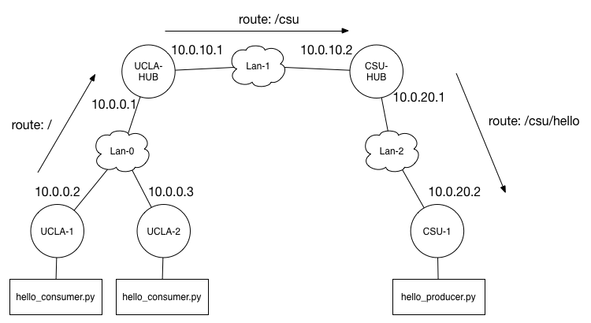
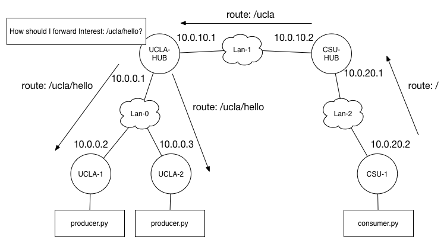
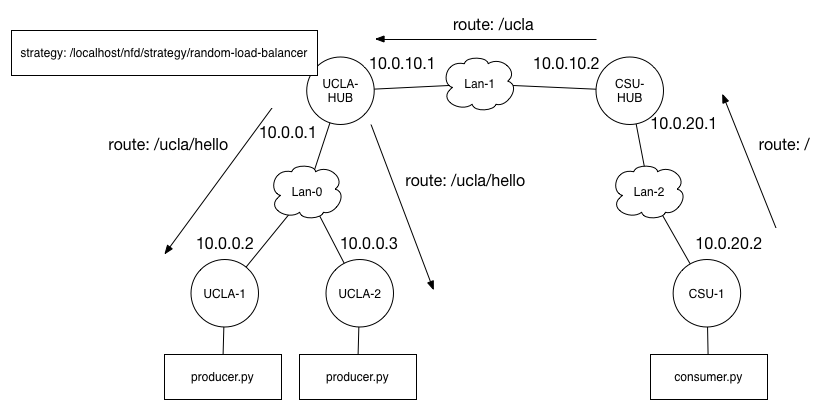

GEC 21 NDN Tutorial Code Walkthrough
==============================================

This guide will walk you through writing a simple NDN application with
PyNDN2 as well as how to develop a new forwarding strategy for NFD.
More information about NFD, ndn-cxx, PyNDN2, and the rest of the NDN
Platform, can be found at the [NDN Platform homepage](http://named-data.net/codebase/platform/).

The following NDN software has been pre-installed on the provided GENI
node images:

* NFD 0.2.0
* ndn-cxx 0.2.0
* PyNDN2

**Part 1** of code walkthrough will cover writing NDN applications
with the Python CCL library (PyNDN2). We provide template files
(method stubs) that you can fill in using this document under
`app-templates/`. The Python library has been pre-installed on the
GENI node image via pip and should be usable from anywhere (including
the interactive interface):

    $ python
    >>> import pyndn
    >>> print "Hello", pyndn.Name("world").toUri()
    Hello,  /world

**Part 2** will discuss how to implement your own forwarding
strategy. Strategy code templates are provided under
`strategy-templates/`. We also provide two applications (consumer.py
and producer.py) to help test and demonstrate the completed strategies
that can be found under `tools/`. In particular, producer.py allows
you to delay the producer's response to artificially add latency.

Solution code for both Part 1 and Part 2 is available under the
`solutions/` directory.

# Setup

## Creating a GENI Slice

* **Step 1:** Import **ndn-tutorial-rspec.txt** into Jacks.
* **Step 2:** Select your assigned aggregate manager from the drop down menu.

## Environment Configuration

* **Step 1:** cd into `ndn-tutorial-gec21/tools/`.
* **Step 2:** Open `ndn-tutorial-config.sh` and edit the environment variables accordingly. (**Windows:** skip this step.)
* **Step 3:** Execute `copy-scripts.sh`. (**Windows:** copy the 2 scripts under
  `tools/.remote-scripts/` to `/usr/local/bin` on each GENI node.)

# Part 1: Writing NDN Applications with PyNDN2

This section illustrates how to write simple, but functionally
complete, "Hello World" NDN consumer and producer applications using
the PyNDN2 library. In particular, you will learn how to:

* listen for Interests matching a namespace
* create and send Interests and Data packets
* catch and handle common NDN communication error

These example applications may be a little longer and complex
than the minimal NDN "Hello World" application, but we hope they will
serve as useful starting points for your own applications.

You will implement the following scenario:

The above topology is similar in structure to the real NDN testbed;
university and private sites connect to one another over UDP
tunnels. Specifically, each site has a "hub" node running the new NDN
Forwarding Daemon (NFD). Users at each site also run NFD on their own
machines and connect to the testbed through their local hub.

For this tutorial, you will emulate consumer applications running on
user machines at UCLA (UCLA-1 and UCLA-2) and a producer application
at CSU (CSU-1). After setting up routing between UCLA and CSU, your
consumers can retrieve some simple generated content from the
producer. Finally, you will observe the caching and reuse of named
data.

#### Hello World Producer

Our producer application will serve a "Hello" Data packet in response
to each incoming Interest. To achieve this, the producer will register
a prefix to "listen" for Interests matching said prefix.

* **Step 1:** Open the producer code template located in `ndn-tutorial-gec21/app-templates/hello_producer.py` in an editor.
* **Step 2:** Initialize a KeyChain instance and set our `isDone` state to `False`

<!-- -->

    class Producer(object):

        def __init__(self):
            self.keyChain = KeyChain()
            self.isDone = False

`KeyChain` is an abstraction around your system's key
management. It associates identities with their respective keys. For
example, a user may have multiple identities such as "Home", "Work",
"Friends".

* **Step 3:** Implement the `Producer`'s event loop

<!-- -->

    def run(self, namespace):
        # Create a connection to the local forwarder over a Unix socket
        face = Face()

        prefix = Name(namespace)

        # Use the system default key chain and certificate name to sign commands.
        face.setCommandSigningInfo(self.keyChain, \
                                   self.keyChain.getDefaultCertificateName())

        # Also use the default certificate name to sign Data packets.
        face.registerPrefix(prefix, self.onInterest, self.onRegisterFailed)

        print "Registering prefix", prefix.toUri()

        # Run the event loop forever. Use a short sleep to
        # prevent the Producer from using 100% of the CPU.
        while not self.isDone:
            face.processEvents()
            time.sleep(0.01)

`run` informs NFD of the producer's content prefix so that
Interests can be routed to the correct application. Note
the provided callback functions: `onInterest` and `onRegisterFailed`. As their names imply,
`onInterest` is invoked when the application receives an Interest and `onRegisterFailed`
is called if the prefix registration process encounters an error.

* **Step 4:** Implement the `onInterest` callback.
    * Print the name of the incoming Interest
    * Create, sign, and send a response Data packet that echoes the Interest's
    name with a "hello" message.

<!-- -->

    def onInterest(self, prefix, interest, transport, registeredPrefixId):
        interestName = interest.getName()

        data = Data(interestName)
        data.setContent("Hello, " + interestName.toUri())

        hourMilliseconds = 3600 * 1000
        data.getMetaInfo().setFreshnessPeriod(hourMilliseconds)

        self.keyChain.sign(data, self.keyChain.getDefaultCertificateName())

        transport.send(data.wireEncode().toBuffer())

        print "Replied to: %s" % interestName.toUri()

* **Step 5:** Implement the `onRegisterFailed` callback.
    * Print the name of the prefix that failed to register.

<!-- -->

    def onRegisterFailed(self, prefix):
        print "Register failed for prefix", prefix.toUri()
        self.isDone = True

**You now have a complete producer application.**

* **Step 6:** Copy `hello_producer.py` to the CSU-1 node.
* **Step 7:** SSH into CSU-1 and run `nfd-start`. Wait for the shell prompt to return (~10 seconds, you may need to hit Enter).
* **Step 8:** Run your producer with the following command:

<!--  -->

    python hello_producer.py -n /csu/hello

The producer will not do much because it is waiting for
Interests. However, you should see it print a "Registering prefix
/csu/hello".

* **Step 9:** Stop the producer with `ctrl-c`.
* **Step 10:** Stop NFD with the `nfd-stop` command.

#### Hello World Consumer

Next, we'll make a consumer application to send Interests to our
producer and print the response messages. As with the producer,
we'll first begin by creating an encapsulating `Consumer` class.

* **Step 1:** Open the consumer code template located in `ndn-tutorial-gec21/app-templates/hello_consumer.py` in an editor.
* **Step 2:** Initialize the `Consumer`.

<!-- -->

    class Consumer(object):

        def __init__(self, prefix):
            self.prefix = Name(prefix)
            self.outstanding = dict()
            self.isDone = False
            self.face = Face("127.0.0.1")

Note that the `Consumer constructor initializes a dictionary to keep
track of outstanding Interests and retransmissions.

* **Step 3:** Implement the `Consumer`'s event loop.

<!-- -->

    def run(self):
        try:
            self._sendNextInterest(self.prefix)

            while not self.isDone:
                self.face.processEvents()
                time.sleep(0.01)

        except RuntimeError as e:
            print "ERROR: %s" %  e

`Consumer` abstracts the Interest creation and sending process into
its own method to simplify the implementation of retransmission.

* **Step 4:** Implement the Interest sending abstraction.

<!-- -->

    def _sendNextInterest(self, name):
        interest = Interest(name)
        uri = name.toUri()

        interest.setInterestLifetimeMilliseconds(4000)
        interest.setMustBeFresh(True)

        if uri not in self.outstanding:
            self.outstanding[uri] = 1

        self.face.expressInterest(interest, self._onData, self._onTimeout)
        print "Sent Interest for %s" % uri

The `_sendNextInterest` method creates an Interest and
configures its lifetime and the freshness selectors. The lifetime
tells each NDN node to expire the Interest **N**
milliseconds after it arrives (here we use 4000 ms) while the freshness
selector specifies whether the NDN node's Content Store may satisfy
the Interest with stale content (i.e Data that has been held past its
FreshnessPeriod).

`self.outstanding` counts the number of transmission attempts for each Interest by the URI of its name.

The key part of `_sendNextInterest` is the
`self.face.expressInterest` call. This method actually sends the Interest
and takes callbacks to invoke when a matching Data packet arrives and for
when the Interest times out, respectively.

* **Step 5:** Implement the Data arrival callback.
  * Prints the payload of the arriving Data.
  * Delete the outstanding Interest entry.

<!-- -->

    def _onData(self, interest, data):
        payload = data.getContent()
        name = data.getName()

        print "Received data: ", payload.toRawStr()
        del self.outstanding[name.toUri()]

        self.isDone = True

* **Step 6:** Implement the Interest timeout callback.
  * Increment the retry count and resend at most 3 times.

<!-- -->

    def _onTimeout(self, interest):
        name = interest.getName()
        uri = name.toUri()

        print "TIMEOUT #%d: %s" % (self.outstanding[uri], uri)
        self.outstanding[uri] += 1

        if self.outstanding[uri] <= 3:
            self._sendNextInterest(name)
        else:
            self.isDone = True

**You now have a completed consumer application.**

* **Step 7:** Copy your `hello_consumer.py` to the CSU-1 node (where your producer script should also reside).
* **Step 8:** SSH into CSU-1 with two terminals and run `nfd-start` in one of them. Wait for the shell prompt to return (~10 seconds, you may need to hit Enter).
* **Step 9:** Run your producer and consumer scripts in separate terminals:

<!-- -->

    python hello_producer.py -n /csu/hello
    python hello_consumer.py -u /csu/hello

Note that we use "/csu/hello" here for the name of the Data to request
and similarly told the producer application to to serve/generate
content under the "/csu/hello" namespace. If everything is working,
your producer and consumer should print a message indicating that they
successfully received the Interest and Data, respectively.

What happens if you run the consumer again without restarting NFD and
the producer?

* **Step 10:** Stop the producer with `ctrl-c`.
* **Step 11:** Stop NFD with the `nfd-stop` command.

#### Running the Hello World Application Scenarios

With your producer and consumer applications finished, let's try
scaling up the scenario.

* **Step 1:** Copy your `hello_consumer.py` to the GENI nodes labelled UCLA-1 and
UCLA-2. **No action is required for your producer application.**
* **Step 2:** cd into `ndn-tutorial-gec21/tools/`.
* **Step 3:** (Re)start the NFD instance on each node and setup routing by running `setup-app.sh` on your local machine.
  * **Windows:** SSH into each node and run the following commands instead of using `setup-app.sh`:

<!-- -->

    nfd-stop; sleep 2; nfd-start;
    sh /usr/local/bin/setup-app-remote.sh

* **Step 4:**. SSH into CSU-1 and start the producer:

<!-- -->

    python hello_producer.py -n /csu/hello

* **Step 5:**. SSH into UCLA-1 and UCLA-2 and run one consumer on each:

<!-- -->

    python hello_consumer.py -u /csu/hello

You should see each consumer print a message indicating that they
successfully pulled the content. However, your producer should once
again show that it only served a single request. Depending on the
execution timing of the consumers (i.e. whether one completed
first or both ran before one finished), you will have observed caching
and/or PIT aggregation in action. If both Interests are in flight at
same time, only one will reach the producer and the other will be
aggregated on the first's PIT entry at the junction NDN
node. Alternatively, one Interest may retrieved the cached Content
Store entry created by Data returning in response to the original
Interest's request.

* **Step 6:** Stop the producer with `ctrl-c`.

## Going Further

So far, we covered how to create basic producer and consumer
applications.  These applications can be easily extended to support
publishing and retrieving larger data sets through segmentation and
Interest pipelining. Please see
https://github.com/dibenede/ndn-tutorial-gec21 for an extended guide
that steps through some simple enhancements.

# Part 2: Writing Forwarding Strategies

Forwarding strategies are a key component of NFD's *forwarding
pipelines*; they are responsible for choosing the set of Faces through
which an outgoing Interest will be forwarded. Strategies are
associated with namespaces (i.e. per prefix), thus allowing fine grain
control over how an NDN node forwards.

In NFD, the forwarding strategy can be thought of as the "last stop"
for an outgoing Interest. By the time a strategy is invoked the CS and
PIT have already been checked for cache hits and duplicates,
respectively. Similarly, NFD forwarding strategies are also informed
when Data packets arrive so that the strategies can attempt to keep
measurement and other performance information. Specifically,
strategies are notified of Data when it is about to satisfy a PIT
entry.

NFD allows developers to implement and enable custom forwarding
strategies. Developers can inherit from an abstract ``Strategy`` base
class and overload its methods, called *triggers*, that allow the
custom strategy to perform a range of actions before Interests are
sent out and PIT entries are satisfied by returning Data. For more
information on the details of NFD forwarding strategies and pipelines,
interested readers should refer to *the NFD Developer's Guide* at
http://named-data.net/wp-content/uploads/2014/07/NFD-developer-guide.pdf

Unlike NDN applications, which can be implemented in a wide range of
languages, forwarding strategies must be written in C++. Consequently,
there are often large amounts of setup and accounting code that are
unsuitable for quickly understanding what is going on in a new
forwarding strategy. This section of the guide will omit much of the
surrounding code such as header files and helper methods specific to
the strategy's implementation.

You will implement a basic forwarding strategy and use it in a
plausible scenario. CSU-1 is now a consumer requesting /ucla/hello
content hosted that will be served from either UCLA-1 or UCLA-2. The
producer hub node, UCLA-HUB, is aware of two routes and employs a
forwarding strategy to determine how incoming Interests should be load
balanced across them.

## Random Load Balancer

We will create a stateless, random, load balancer strategy called
`RandomLoadBalancerStrategy`. Given a set of possible outgoing Faces,
this strategy will select one at random for forwarding.

* **Step 1:** Open the strategy code template located in `ndn-tutorial-gec21/strategy-templates/random-load-balancer-strategy.cpp` in an editor.
* **Step 2:** Override `Strategy::afterReceiveInterest` to randomly choose a next
  hop for each Interest.

<!-- -->

    void
    RandomLoadBalancerStrategy::afterReceiveInterest(const Face& inFace,
                                                     const Interest& interest,
                                                     shared_ptr<fib::Entry> fibEntry,
                                                     shared_ptr<pit::Entry> pitEntry)
    {
      if (pitEntry->hasUnexpiredOutRecords())
        {
          // not a new Interest, don't forward
          return;
        }

      const fib::NextHopList& nexthops = fibEntry->getNextHops();

      // Ensure there is at least 1 Face is available for forwarding
      if (!hasFaceForForwarding(nexthops, pitEntry))
        {
          this->rejectPendingInterest(pitEntry);
          return;
        }

      fib::NextHopList::const_iterator selected;
      do
        {
          boost::random::uniform_int_distribution<> dist(0, nexthops.size() - 1);
          const size_t randomIndex = dist(m_randomGenerator);

          uint64_t currentIndex = 0;

          for (selected = nexthops.begin();
               selected != nexthops.end() && currentIndex != randomIndex;
               ++selected, ++currentIndex)
            { }
        } while (!canForwardToNextHop(pitEntry, *selected));

      this->sendInterest(pitEntry, selected->getFace());
    }

The provided FIB entry contains a list-type (via iterators) of
nexthops for the prefix.  The rest of the code generates a random
number, *i*, and selects the *i-th* nexthop for forwarding.
`Strategy::sendInterest` method is used to actually forward the
Interest.

Note that forwarding strategies can also *drop* Interests they
determine should not be forwarded. `RandomLoadBalancerStrategy` drops
Interests when it does not have any Faces available for forwarding, as
seen in the call to `Strategy::rejectPendingInterest`. Hypothetically,
Interests may also be dropped for policy reasons such as scope
control.

**You now have a complete forwarding strategy.**

Aside from some setup C++ code and lightweight helper methods, the
above code is all it takes to create a new forwarding strategy that
can send or reject Interests.

## Installing and Running the Random Load Balancer Forwarding Strategy

* **Step 1:** Copy `random-load-balancer-strategy.{cpp, hpp}` to your home directory on UCLA-HUB.
* **Step 2:** SSH into UCLA and move the copied forwarding strategy files into NFD's forwarding code directory:

<!-- -->

    sudo mv random-load-balancer-strategy.* `/usr/local/src/NFD/daemon/fw/`

* **Step 3:** Modify `/usr/local/src/NFD/daemon/fw/available-strategies.cpp` to "install"
the random load balancer strategy.

<!-- -->

    // Add an include at the top of the file
    #include "random-load-balancer-strategy.hpp"

    ...

    void
    installStrategies(Forwarder& forwarder)
    {
      ...

      // Add strategy to be installed
      installStrategy<RandomLoadBalancerStrategy>(forwarder);
    }

This informs NFD that it has a new forwarding strategy at its disposal.

* **Step 4:** Compile and re-install NFD on UCLA-HUB:

<!-- -->

    cd /usr/local/src/NFD
    sudo ./waf
    sudo ./waf install

* **Step 5:** cd into `ndn-tutorial-gec21/tools/`.
* **Step 6:** (Re)start the NFD instance on each node and setup routing by running:

<!-- -->

    setup-strategy.sh random

* **Windows:** SSH into each node and run the following commands
    instead of using `setup-strategy.sh`:

<!-- -->

    nfd-stop; sleep 2; nfd-start;
    sh /usr/local/bin/setup-strategy-remote.sh random

In this scenario, UCLA-1 and UCLA-2 are producers and CSU-1 is the
consumer. UCLA-HUB, which you installed the forwarding strategy on,
will load balance requests across the producers.

* **Step 7:** Copy `tools/consumer.py` to CSU-1.
* **Step 8:** Copy `tools/producer.py` to UCLA-1 and UCLA-2.
* **Step 9:** SSH into UCLA-1 and UCLA-2 and run one producer instance on each:

<!-- -->

    python producer.py -n /ucla/hello

* **Step 10:** SSH into CSU-1 and run the consumer:

<!-- -->

    python consumer.py -u /ucla/hello -c 100

The`-c 100` tells the consumer to generate 100 distinct Interests.

* **Step 11:** Check your terminals on UCLA-1 and UCLA-2 to observe the Interests that have been received and replied to. The trailing (# <number>) indicates the number of Interests that have been received so far.
* **Step 12:** Try adding a 2 second delay to one producer and having the consumer
request 100 packets again. (**Make sure you stop both producers with** `ctrl-c` **and re-run** `setup-strategy.sh` **or the alternative Windows instructions first.**)

<!-- -->

    python producer.py -n /ucla/hello -d 2

Note how long it takes the consumer to finish. How could this strategy
be improved?

* **Step 13:** Stop both producers with `ctrl-c`.

## Going Further

Hopefully you have some ideas of how the random load balancer strategy
could be extended to produce better results. NFD also provides data
structures for storing measurement information that may be used by
forwarding strategies for keeping track of retrieval performance and
adjusting Interest forwarding accordingly. Please see
https://github.com/dibenede/ndn-tutorial-gec21 for an extended guide
that walks through an improved forwarding strategy that utilizes
measurements.
